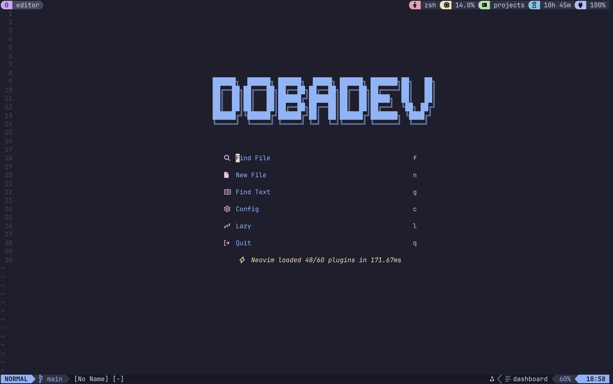
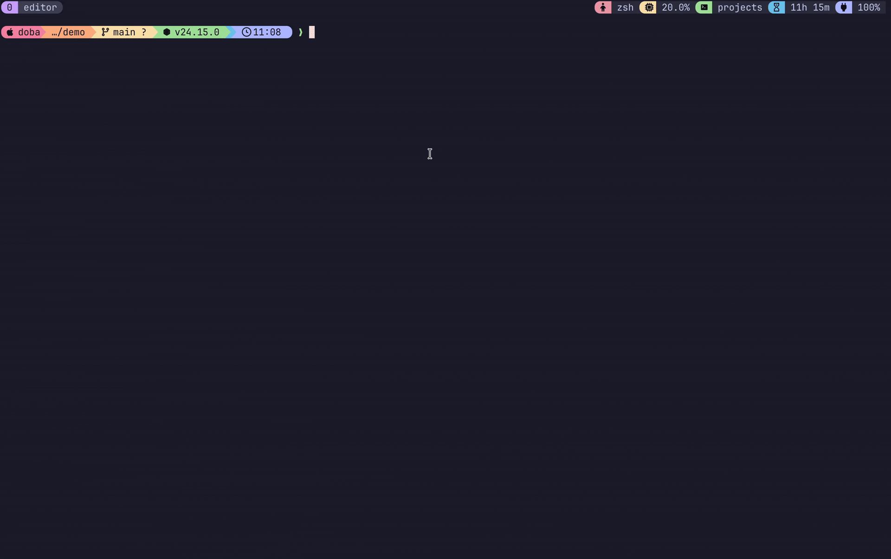

<div align="center">

<pre>
██████╗  ██████╗ ██████╗  █████╗ ██████╗ ███████╗██╗   ██╗
██╔══██╗██╔═══██╗██╔══██╗██╔══██╗██╔══██╗██╔════╝██║   ██║
██║  ██║██║   ██║██████╔╝███████║██║  ██║█████╗  ██║   ██║
██║  ██║██║   ██║██╔══██╗██╔══██║██║  ██║██╔══╝  ╚██╗ ██╔╝
██████╔╝╚██████╔╝██████╔╝██║  ██║██████╔╝███████╗ ╚████╔╝ 
╚═════╝  ╚═════╝ ╚═════╝ ╚═╝  ╚═╝╚═════╝ ╚══════╝  ╚═══╝  
</pre>



**The workspace of a dev who'd rather touch the keyboard than the mouse.**

*macOS · Catppuccin Mocha · Neovim · tmux · a suspicious number of tools starting with `lazy`*

</div>

---

## See it in action

<details>
<summary>🎬 Click to watch the demos</summary>

<br>

<div align="center">




</div>

</details>

## What is this?

Not a framework. Not a starter kit. It's just my machine, packed into a repo so that
if my laptop ever dies, I'm still me on the next one.

Every file here exists for a reason: one annoyed reach for the arrow keys, one too many
times doing timezone math in my head, one look at a default prompt that felt a bit too
plain. Put together, it's a taste.

## The taste

### 🌙 One palette to rule them all: Catppuccin Mocha

Terminal, editor, tmux, prompt, `bat`, `delta`, `eza`, `lazygit`, `yazi`: they all wear
the same soft pastel-on-dark outfit. Jumping between apps never feels like changing
channels. Neovim even has its background stripped to transparent and lets the terminal
handle the rest.

### ⌨️ Hands stay on the home row

- **The tmux prefix is `Ctrl + f`**, not `Ctrl + b`, because `b` is too far away.
  Panes split with `|` and `-`, which look like the split they make. The status bar
  sits **on top**, like browser tabs.
- In Neovim, **`U` is redo**. `u` undoes, `U` redoes. That's just how it should be.
  `+` / `-` bump numbers, `Alt + j/k` move lines around.
- `vim-tmux-navigator` erases the border between tmux panes and Neovim splits.

### 🐚 A shell that speaks shorthand

The commands my fingers already know got quietly upgraded underneath, no new habits
needed:

| Type   | Actually runs |
| ------ | ------------- |
| `cd`   | `zoxide`, which remembers everywhere I've been |
| `cat`  | `bat`, with colors and line numbers |
| `ls`   | `eza`, with icons and hidden files |
| `n`    | `nvim` |
| `lg`   | `lazygit` |
| `y`    | `yazi`, and quitting drops me in whatever folder I was browsing |
| `work` | spins up every tmuxinator session and drops me straight in |

Plus a few homemade helpers:

- **`now`** prints an ISO timestamp, but reads dates and times in **Vietnam time (UTC+7)**.
  `now -d 15 -h 9` means 9 AM on the 15th, already converted to UTC. Written because
  I got tired of subtracting 7 hours in my head every time I tested an API.
- **`j2q` / `q2j`** convert between JSON and query strings.
- **`dbml`** turns the schema of a few Postgres tables into a DBML diagram in one command.
- **`bump_patch`** bumps the version tag and asks once more before pushing. Better safe.

### ✨ A rainbow prompt

Starship is drawn as one continuous powerline strip: red → peach → yellow → green →
sapphire → lavender. OS, user, directory, git branch, current language, the time, all
on one line. The `❯` turns green when things are fine and red when something just broke.

### 📝 Neovim, built brick by brick

No prebuilt distro. 30+ hand-picked plugins, one file each: LSP + Mason, Telescope,
Treesitter, DAP for debugging, Neotest for running tests, Diffview and git-conflict for
untangling merges, `flash` for jumping, `cinnamon` for smooth scrolling, `noice` for a
cleaner UI. Open it and a giant **DOBADEV** says good morning, along with how many
plugins loaded in how many milliseconds ⚡.

### 🤖 AI follows the house rules too

The `agents/` folder is the rulebook for every AI coding agent working on this machine
(Claude Code, Codex, OpenCode, Kiro…):

- Uncle Bob's **Clean Code** is the default.
- **TDD is mandatory**: Red → Green → Refactor. Fixing a bug means writing a test that
  keeps it fixed.
- `snake_case` in the database, `camelCase` in the code, and the two worlds don't mix.
- Go gets table-driven tests and constructors that take a single `Deps` struct.
  TypeScript gets **no `enum`s**, only `as const`.
- A few homemade skills, like a pipeline that runs idea → spec → plan → code → review
  in one go.

Human or machine, code in my repos has to be equally clean.

### 🍺 Brewfile: a portrait in packages

Read the `Brewfile` and you can guess what I do: Go, Node/Bun/Deno, Java, a bit of mobile,
Postgres, Docker, Kubernetes, gRPC… and **Zalo**, because I'm Vietnamese after all 🇻🇳.

## The collection

```
.config/
├── nvim/        Neovim, assembled on lazy.nvim
├── ghostty/     current terminal
├── starship.toml
├── lazygit/     with a command to describe each branch
├── yazi/        file manager in the terminal
├── bat/ delta/ eza/
└── opencode/ posting/
.tmux.conf       Ctrl+f prefix, status bar on top
.wezterm.lua     the old terminal, kept for sentimental reasons
.zshrc*          shell, aliases, environment
.gitconfig       side-by-side delta, a few GitLab MR aliases
Brewfile         everything installed via Homebrew
agents/          the rulebook for AI
```

---

<div align="center">

*Dotfiles are never "done". This is just today's version of me.*

**— dobadev**

</div>
