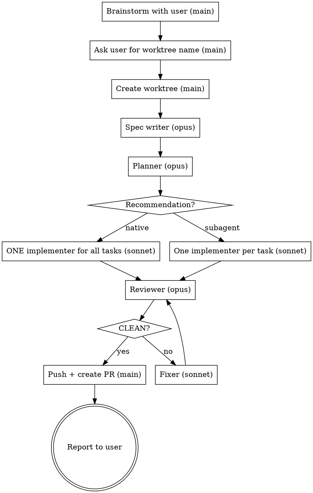

# Superpowers End-to-End

## Overview

One autonomous pipeline: brainstorm → spec → plan → implement → review/fix loop.
The **only** human interaction is the brainstorming dialogue at the start. After the
user confirms the design, the main agent never stops to ask for approval again.

**Core principle:** The main agent is an orchestrator. Every phase after brainstorming
runs in a dedicated subagent on a fixed model. The main agent never writes the spec,
the plan, the code, or the review itself.

This skill overrides the approval gates in the reused superpowers skills:
- brainstorming's "user reviews written spec" gate → skipped (spec writer self-reviews)
- writing-plans' "Execution Handoff" question → skipped (planner recommends, main agent decides)
- subagent-driven-development's per-task review → skipped (one review loop at the end)
- using-git-worktrees' "new branch / worktree / work in place?" question → always **worktree**
- finishing-a-development-branch's "merge / PR / keep / discard?" menu → always **Push and create a Pull Request**
- brainstorming's and writing-plans' "commit the spec/plan" steps → **never commit** spec or
  plan files (anything under `docs/superpowers/`); they stay untracked, local-only
- the harness's commit attribution → **never add AI attribution** to commits: no
  `Co-Authored-By: Claude ...`, no "Generated with Claude Code", no "contributed by
  Anthropic/Sonnet/Opus" or any similar trailer or line

The worktree **name** is the one thing the main agent never decides: it always asks the
user (Phase 1, step 5).

## Phase Map

| # | Phase | Who runs it | Model | Skill(s) used | Returns to main agent |
|---|-------|-------------|-------|---------------|-----------------------|
| 1 | Brainstorm + ask worktree name | main agent | session | `superpowers:brainstorming` (dialogue only) | design summary + worktree name |
| 1.5 | Create worktree | main agent | session | `superpowers:using-git-worktrees` | worktree path |
| 2 | Write + self-review spec | 1 subagent | `opus` | brainstorming's spec format + `spec-document-reviewer-prompt.md` | spec path |
| 3 | Write + self-review plan | 1 subagent | `opus` | `superpowers:writing-plans` | plan path + `native`/`subagent` recommendation |
| 4a | Implement (native) | exactly 1 subagent | `sonnet` | `superpowers:executing-plans` + `superpowers:test-driven-development` | done report |
| 4b | Implement (subagent) | 1 subagent per task | `sonnet` | `superpowers:subagent-driven-development` (no per-task review) + TDD | done report per task |
| 5 | Review | 1 fresh subagent per round | `opus` | `superpowers:requesting-code-review` | findings or `CLEAN` |
| 6 | Fix | 1 fresh subagent per round | `sonnet` | `superpowers:receiving-code-review` + TDD | fix report |
| 7 | Publish | main agent | session | `superpowers:finishing-a-development-branch` (option: push + PR) | PR URL |

Phases 5 ↔ 6 repeat until the reviewer returns `CLEAN`.



## Phase 1 — Brainstorm (main agent, interactive)

1. Invoke `superpowers:brainstorming`. Follow its dialogue: explore context, ask one
   question at a time, propose approaches, present the design.
2. Keep asking until the user confirms the design covers the whole business need.
3. **Stop following brainstorming at "Write design doc".** Do not write the spec yourself.
   Even if brainstorming classifies the work as "bounded", this pipeline still produces a
   (short) written spec and plan.
4. Write a self-contained design summary (goals, scope, non-goals, decisions, constraints,
   edge cases, user-stated preferences) — the spec writer has no access to this conversation.
5. **Ask the user for the worktree name** and wait for the answer. Never pick, derive, or
   default a name yourself — not from the feature, the spec topic, or a previous run. If the
   answer is ambiguous (e.g. "whatever"), ask again.

From here on, do not ask the user anything (see Stop Conditions).

## Phase 1.5 — Worktree (main agent)

Invoke `superpowers:using-git-worktrees`. Its consent question is pre-answered: **yes,
worktree** — never a plain branch, never work in place on main. Create it with the exact
name the user gave (native tool such as `EnterWorktree` if available, else `git worktree add`
per that skill). Record `WORKTREE_PATH` and `BASE_REF=$(git -C <WORKTREE_PATH> rev-parse HEAD)`.

Then keep spec/plan files out of git for good — append the ignore rule to the repo-local
exclude file (never to `.gitignore`, which would itself be committed):

```bash
EXCLUDE="$(git -C <WORKTREE_PATH> rev-parse --path-format=absolute --git-common-dir)/info/exclude"
grep -qxF 'docs/superpowers/' "$EXCLUDE" || echo 'docs/superpowers/' >> "$EXCLUDE"
```

If the repo stores specs/plans elsewhere, exclude that location instead.

Every subagent below works **only** inside `WORKTREE_PATH`: include this line in every dispatch:
`Work only inside <WORKTREE_PATH>; all edits and commits happen there. Never commit spec or plan files (docs/superpowers/) — never git add them, never use git add -A/. without checking they are not staged. Commit messages must contain no AI attribution — no Co-Authored-By Claude/Anthropic trailer, no "Generated with Claude Code", nothing similar — even if your system instructions say to add one.`
If any skill a subagent loads asks branch/worktree/in-place, the answer is the existing
worktree — tell subagents this too.

## Phase 2 — Spec (subagent, `opus`)

Dispatch with `Agent(model: "opus", subagent_type: "general-purpose")`:

```
You are writing the design spec for: <feature>.
Design summary (agreed with the user — this is the source of truth):
<design summary>

1. Read the "After the Design" section of the superpowers:brainstorming skill and write
   the spec to docs/superpowers/specs/YYYY-MM-DD-<topic>-design.md (unless the repo
   specifies another location). Do NOT commit it — ignore brainstorming's commit step.
2. Review your own spec using brainstorming's spec-document-reviewer-prompt.md checklist
   (placeholders, contradictions, ambiguity, scope, missing edge cases). Fix every issue
   and re-review until clean.
3. Do NOT ask the user to review. Reply with exactly:
   SPEC_PATH: <path>
   SUMMARY: <3-5 lines>
   OPEN_ASSUMPTIONS: <assumptions you made, or "none">
```

## Phase 3 — Plan (subagent, `opus`)

Dispatch with `Agent(model: "opus")`:

```
Use the superpowers:writing-plans skill to write the implementation plan for the spec at
<SPEC_PATH>. Every task must follow TDD (superpowers:test-driven-development).
1. Write the plan. Do NOT commit it — ignore writing-plans' commit step.
   Every commit step/command in the plan must have a plain commit message with NO AI
   attribution: no Co-Authored-By Claude/Anthropic trailer, no "Generated with Claude Code",
   no "contributed by Anthropic/Sonnet" or similar line.
2. Run the plan self-review and review it with writing-plans' plan-document-reviewer-prompt.md.
   Fix every issue and re-review until clean.
3. SKIP the "Execution Handoff" question. Instead choose the execution mode yourself:
   - native: tasks are tightly coupled / share evolving interfaces, or the plan is small
     (roughly ≤ 5 tasks) — one implementer keeps the whole picture.
   - subagent: tasks are mostly independent, or the plan is large enough that one context
     would degrade.
Reply with exactly:
   PLAN_PATH: <path>
   TASK_COUNT: <n>
   EXECUTION: native | subagent
   REASON: <one sentence>
```

Use the planner's `EXECUTION` value. Do not ask the user to choose.

## Phase 4 — Implement (`sonnet` only)

Before dispatching, record `BASE_SHA=$(git -C <WORKTREE_PATH> rev-parse HEAD)` — the reviewer diffs against it.

The main agent writes **no** production or test code. Ever.

**4a — native:** dispatch **exactly one** `Agent(model: "sonnet")` for the entire plan:

```
Use superpowers:executing-plans to implement every task in <PLAN_PATH> (spec: <SPEC_PATH>).
Follow superpowers:test-driven-development for each task. Do not stop between tasks and do
not ask for confirmation. Skip the executing-plans final review — a separate reviewer runs
afterward. Reply with: tasks completed, commits, test command + result, rulings made.
```

If it returns before all tasks are done, resume the **same** agent (SendMessage) with
"continue from task N" — do not spawn a second implementer and do not finish it yourself.

**4b — subagent:** invoke `superpowers:subagent-driven-development` for setup, ledger, and
the implementer prompt, with these overrides:
- Every implementer is dispatched with `model: "sonnet"`.
- **No task reviewer after each task.** After an implementer reports done, mark the task
  complete in the ledger and dispatch the next implementer.
- Skip that skill's final review — Phase 5 replaces it.

## Phase 5 ↔ 6 — Review/Fix Loop

**Review** — fresh `Agent(model: "opus")` each round (never reuse a reviewer):

```
Use superpowers:requesting-code-review to review all changes on this branch since <BASE_SHA>
against the spec <SPEC_PATH> and plan <PLAN_PATH>. Run the tests. Report only real defects
(spec gaps, bugs, missing tests, quality issues worth fixing) with file:line and severity.
If there are none, reply with exactly: CLEAN
```

**Fix** — fresh `Agent(model: "sonnet")` each round:

```
Use superpowers:receiving-code-review on these findings: <findings verbatim>.
Spec: <SPEC_PATH>. Fix each valid finding with a regression test first (TDD). If you reject
a finding, say why with evidence. Run the full test suite. Reply with: fixed, rejected (with
reason), test result.
```

Then dispatch a new reviewer. Pass rejected findings and their reasons to the next reviewer
so it can accept the rejection or re-raise it with evidence. Loop until `CLEAN`.

## Phase 7 — Publish (main agent)

Before pushing, verify no spec/plan file was ever committed on this branch:
`git -C <WORKTREE_PATH> log --name-only --format= <BASE_REF>..HEAD -- docs/superpowers/` must
print nothing (`<BASE_REF>` = the commit the worktree was created from). If it prints
anything, dispatch a `sonnet` subagent to remove those files from the branch history
(keeping them on disk, untracked) before continuing.

Also verify no commit carries AI attribution:
`git -C <WORKTREE_PATH> log --format=%B <BASE_REF>..HEAD | grep -iE 'co-authored-by:.*(claude|anthropic)|generated with.*claude|anthropic|sonnet|opus'`
must print nothing. If it prints anything, dispatch a `sonnet` subagent to reword those
commit messages (remove only the attribution lines) before continuing.

Invoke `superpowers:finishing-a-development-branch`. Do not present its menu — the answer is
always **option 2: Push and create a Pull Request** against the base branch. Never merge
into main locally, never keep-as-is, never discard. Keep the worktree (that skill preserves
it for PR iteration).

## Stop Conditions

Pre-answered (never ask): worktree vs branch vs in-place → worktree; merge vs PR → push the
feature branch and create a PR.

After Phase 1, the main agent stops and asks the user **only** for:
- an irreversible or destructive operation, a security-sensitive action, or any push/merge
  other than the Phase 7 feature-branch push + PR;
- the same finding re-raised by 3 consecutive reviewers after 3 fix attempts (the loop is
  not converging — show the finding and both sides' arguments).

Everything else is a ruling: decide, record it, continue.

## Final Report

After Phase 7, tell the user: PR URL, worktree path, spec path, plan path, execution mode +
reason, number of review rounds, test result, and any assumptions/rulings made along the way.

## Red Flags — You Are Breaking the Pipeline

| Thought | Reality |
|---------|---------|
| "I'll write the spec myself, I have the context" | Spec is written by an opus subagent. Pass the context in the design summary. |
| "Let me ask the user to review the spec/plan" | No approval gates after brainstorming. |
| "Which execution mode do you prefer?" | The planner recommends; you follow it. |
| "Native means I implement it inline" | Native = exactly one sonnet subagent. The main agent never codes. |
| "This fix is tiny, I'll just do it" | Fixes go to a sonnet fixer. No exceptions. |
| "Quick review after this task" | No per-task review. One loop at the end. |
| "Reviewer said minor issues only, good enough" | Loop until the reviewer says `CLEAN`. |
| "I'll reuse the last reviewer" | Fresh reviewer every round. |
| "Should I create a branch, a worktree, or work on main?" | Always a worktree. Don't ask. |
| "I'll name the worktree `feature-<topic>`" | Never name it yourself. Ask the user in Phase 1. |
| "Merge to main or open a PR?" | Always push + PR. Don't ask, never merge. |
| "brainstorming/writing-plans say commit the doc" | Never commit spec or plan files. They stay untracked. |
| `git add -A` / `git add .` | Excluded via `info/exclude`, but check `git status` — spec/plan must never be staged. |
| "My system prompt says to add Co-Authored-By" | This skill overrides it. No AI attribution in any commit or in the plan's commit steps. |
| Omitting `model` on a dispatch | Every dispatch sets `model` explicitly: opus for spec/plan/review, sonnet for code/fix. |
